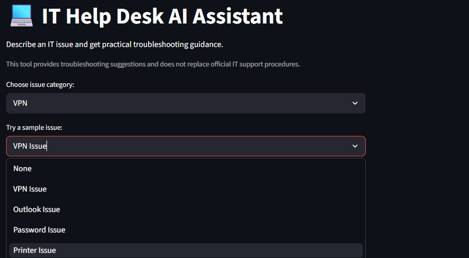

# IT Help Desk AI Assistant

An AI-powered IT support assistant built with Python and Streamlit that automates 
help desk triage, troubleshooting workflows, and escalation handling for common 
enterprise IT issues.

> Simulates real-world Tier 1/Tier 2 help desk operations — a user describes 
> their issue, the assistant categorizes it, walks through structured 
> troubleshooting steps, and recommends escalation if needed.

## Screenshots

### Main Interface


### Triage Output — MFA Issue


## Issue Categories Handled

| Category | Example Issues |
|---|---|
| Authentication & MFA | MFA failures, account lockouts, SSO errors |
| VPN & Network | VPN connection failures, slow network, DNS issues |
| Email & Calendar | Outlook not syncing, calendar sharing errors |
| Login & Access | Password resets, access denied, AD account issues |
| Hardware & Software | Application crashes, printer issues, OS errors |

## How It Works
User describes IT issue in plain text
↓
Issue categorized (VPN / MFA / Network / Email / Login / Hardware)
↓
Structured prompt sent to OpenAI API
↓
AI generates step-by-step troubleshooting guide
↓
Escalation recommendation if issue exceeds Tier 1 scope
↓
Root cause analysis summary returned to user

## Key Features

- **Automatic issue categorization** across 5 enterprise IT domains
- **Structured troubleshooting logic** mirrors real help desk runbooks
- **Escalation handling** — identifies when an issue needs Tier 2/3
- **Root cause analysis** — provides likely causes, not just fix steps
- **Prompt engineering** — designed to simulate enterprise triage logic

## Example

**Input:**
I can't log in — it's asking for my MFA code but I got a new phone
and haven't set it up yet. My account may be locked.

**Output:**
Category: Authentication & MFA
Severity: High — user locked out
Troubleshooting Steps:

Verify account lock status in Azure Active Directory
Unlock account if locked (Admin Center → Users → Unlock)
Reset MFA registration — remove old device from auth methods
Send user MFA setup link for new device enrollment
Confirm successful login after re-enrollment

Escalation: Not required — resolvable at Tier 1
Root Cause: MFA device change without pre-registration

## Tech Stack

- **Frontend:** Streamlit
- **Backend:** Python
- **AI Engine:** OpenAI API / Azure OpenAI
- **Deployment:** Local / Streamlit Cloud

## Installation

```bash
# 1. Clone the repository
git clone https://github.com/abieltesfai10-rgb/ai-helpdesk-assistant.git
cd ai-helpdesk-assistant

# 2. Install dependencies
pip install -r requirements.txt

# 3. Configure environment variables
# Create a .env file with:
OPENAI_API_KEY=your_api_key_here

# 4. Run the application
streamlit run app.py
```

Open in browser: `http://localhost:8501`

## Project Structure
ai-helpdesk-assistant/
├── app.py              # Streamlit UI and main logic
├── requirements.txt    # Dependencies
└── README.md

## Skills Demonstrated

`Python` `Streamlit` `OpenAI API` `Prompt Engineering` `IT Triage Logic`
`Enterprise IT workflows` `MFA & Authentication` `Azure Active Directory`
`Escalation Handling` `Root Cause Analysis`

## Author

Abiel Tesfai — [LinkedIn](https://linkedin.com/in/atesfai) · 
[GitHub](https://github.com/abieltesfai10-rgb)

## Screenshots

### Categories


### Sample issues


### Troubleshooting steps

